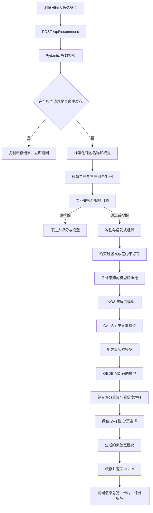

# Ionmix 完整代码逻辑注释

> 本文档对应当前仓库代码，用“模块注释 + 数据流 + 关键公式”的方式解释系统。它不是把每一行源码重新抄一遍，而是说明每个文件、类、函数为什么存在、接收什么、输出什么，以及它们怎样串成完整网站。

## 1. 一句话理解项目

Ionmix 是一个电池电解液实验前预筛选系统：用户给出锂盐、温度、浓度、应用场景、硬约束和五项目标权重，后端枚举二元/三元溶剂与配比，先做化学兼容性过滤，再计算物性与机器学习预测，最后按综合评分排序，并明确展示数据覆盖和置信度。

它解决的不是：

```text
“哪个溶剂能溶解某种盐？”
```

而是：

```text
“在盐、温度、浓度、应用场景、安全限制和多目标偏好共同作用下，
哪些配方最值得先做实验？”
```

## 2. 整体调用链



最重要的设计原则是：

1. **模型预测和专业规则分离**：模型回答“性质可能怎样”，规则回答“工程上是否允许推荐”。
2. **综合评分和置信度分离**：综合评分决定排序，置信度描述证据可靠程度。
3. **模拟数据和实验数据分离**：OEDB-MD 只作为辅助，不冒充实验标签。
4. **完整空间粗筛和有限模型精排分离**：所有组合先经过快速计算，只有有竞争力的候选进入昂贵模型。

## 3. 目录与职责

```text
app/
  main.py                 FastAPI 入口、API、缓存、压缩、账户状态
  schemas.py              请求体的数据类型和取值边界
  recommender.py          候选生成、评分、精排、选择、解释
  compatibility.py        专业兼容性规则引擎
  catalog.py              加载并补全溶剂目录
  chemistry.py            RDKit 分子描述符与 SMILES 标准化
  mixture_features.py     把任意一/二/三元配方转成模型特征
  ml_model.py             CALiSol 电导率推理与置信度
  lino3_model.py          LiNO3 溶解度推理与置信度
  mixture_model.py        配方级实验模型推理
  oedb_auxiliary_model.py OEDB-MD 辅助性质推理
  auth_store.py           注册、登录、会话和历史配方存储
  static/index.html       页面结构
  static/styles.css       页面布局和视觉样式
  static/app.js           浏览器交互、请求、分页和渲染

scripts/
  sync_public_data.py             下载 CALiSol、同步 PubChem
  sync_oedb_data.py               下载并清洗 OEDB
  build_mixture_experiments.py    构建统一实验表
  train_conductivity_model.py     训练 CALiSol 电导率模型
  train_lino3_solubility_model.py 训练 LiNO3 溶解度模型
  train_mixture_model.py          训练配方级电导率/溶解度模型
  train_oedb_auxiliary_model.py   训练 OEDB-MD 辅助模型
  setup_project.ps1               从零准备环境、数据和模型
  start.ps1 / stop.ps1            本地启动与停止

data/                       原始数据、统一数据和溶剂目录
models/                     joblib 模型与训练报告
tests/test_app.py           接口、排序、回退、规则、缓存测试
```

## 4. 后端入口：`app/main.py`

### 4.1 应用初始化

```python
app = FastAPI(...)
app.add_middleware(GZipMiddleware, minimum_size=900)
app.mount("/static", ...)
recommender = FormulationRecommender()
```

含义：

- FastAPI 提供网页与 JSON 接口。
- 大于 900 字节的响应使用 GZip，候选配方较多时可明显减少网络传输量。
- `/static` 提供 HTML、CSS 和 JavaScript。
- `FormulationRecommender` 在进程启动时只初始化一次，模型不会每次请求重复加载。

### 4.2 账户存储状态缓存

`account_storage_status()` 检查当前使用 Supabase/PostgreSQL 还是本地 SQLite。检查结果缓存 30 秒，避免页面每刷新一次就重新连接数据库。

数据库错误先经过 `safe_database_error()`，连接字符串、用户名和密码不会被原样写入日志。

### 4.3 API 一览

| 方法 | 路径 | 作用 |
|---|---|---|
| GET | `/` | 返回主页 |
| GET | `/api/health` | Render 健康检查 |
| GET | `/api/solvents` | 返回候选溶剂目录 |
| GET | `/api/model-info` | 返回模型、数据规模、规则和账户状态 |
| POST | `/api/recommend` | 运行配方筛选 |
| POST | `/api/auth/register` | 注册并创建会话 |
| POST | `/api/auth/login` | 登录 |
| POST | `/api/auth/logout` | 退出 |
| GET | `/api/auth/me` | 查询当前用户 |
| GET/POST | `/api/history` | 读取或保存历史配方 |
| DELETE | `/api/history/{id}` | 删除自己的历史配方 |

### 4.4 推荐请求缓存

`/api/recommend` 把经过 Pydantic 补全默认值后的请求序列化成稳定 JSON，作为缓存键。

```text
相同盐 + 相同温度 + 相同浓度 + 相同约束 + 相同权重 = 相同缓存键
```

缓存最多保留 12 个完整结果，使用 LRU 思路淘汰最久未使用项。返回缓存对象前会 `deepcopy`，防止某个请求修改共享字典。响应中的：

```json
"runtime": {"elapsed_ms": 5.4, "cache_hit": true}
```

用于前端显示本次耗时和是否命中缓存。

## 5. 参数校验：`app/schemas.py`

### 5.1 五项目标权重

`WeightInput` 包含：

- `solubility`：溶解能力；
- `conductivity`：离子传输；
- `safety`：安全性；
- `stability`：电化学稳定性；
- `low_temperature`：低温表现。

每项允许 `0～1`。前端保证总和为 100%，后端评分时仍会再次归一化，因此直接调用 API 时即使总和不是 1，也不会改变分数尺度。

### 5.2 推荐参数边界

`RecommendationRequest` 限制温度、浓度、黏度、闪点、结果数和组分数。这样异常参数在进入模型前就返回 HTTP 422，而不是让模型产生无意义结果。

## 6. 溶剂目录：`app/catalog.py`

`load_catalog()` 优先读取：

```text
data/processed/solvent_catalog.csv
```

如果处理后的目录缺少种子目录中的溶剂，则自动补入 `data/solvent_seed.csv` 中的缺失项。

随后完成四类补充：

1. RDKit 描述符缺失值补全；
2. 训练集名称映射，例如 `GBL → g-Butyrolactone`；
3. 氧化、还原、危害、熔点等粗粒度电池筛选先验；
4. OEDB 溶剂名称映射。

这些先验不是实验电化学窗口，而是没有直接标签时的保守排序信息。

## 7. 分子描述符：`app/chemistry.py`

`molecular_descriptors(smiles)` 使用 RDKit 计算：

- 分子量；
- TPSA；
- LogP；
- 氢键受体/供体数；
- 可旋转键；
- sp3 碳比例；
- 环数。

函数使用缓存，相同 SMILES 不会重复计算。若 RDKit 不可用或 SMILES 非法，系统返回安全默认值，不让整个网站崩溃。

`canonicalize_smiles()` 把不同写法标准化，减少“同一种分子被当作多个类别”的问题。

## 8. 专业规则引擎：`app/compatibility.py`

### 8.1 为什么规则必须独立

高溶解度不等于电池可用。例如某种溶剂可能很好地溶解盐，但会：

- 与锂金属持续发生副反应；
- 在高电压下氧化；
- 腐蚀铝集流体；
- 与强氧化性锂盐形成严重安全风险。

机器学习若只见过溶解度或电导率标签，无法自动学会所有这些边界。因此规则引擎位于模型精排之前。

### 8.2 `CompatibilityRule`

每条规则声明：

- `rule_id`：稳定唯一标识；
- `severity`：`block` 或 `caution`；
- 适用的盐、溶剂、应用场景和浓度；
- 面向用户的提醒；
- 工程依据和来源；
- 风险候选的扣分值。

### 8.3 两种处理方式

`block`：

```text
候选生成 → 命中规则 → 直接删除 → 不进入任何模型 → 不可能出现在结果页
```

`caution`：

```text
候选保留 → 综合评分扣分 → 最终置信度降低 → 卡片显示兼容性提醒
```

### 8.4 当前规则

1. `LiNO3 + DMSO`：按本项目要求默认硬排除。这里的含义不是“不溶解”，而是“不作为通用电池起始配方推荐”。文献中确有专门设计的 Li–O₂ `LiNO3/DMSO` 体系，因此规则文案明确保留这一科学边界。
2. 高电压 `LiTFSI`：铝集流体腐蚀风险，保留为提醒候选并扣分。
3. 高电压 `LiFSI`：铝集流体腐蚀风险，保留为提醒候选并扣分。
4. `LiClO4 + 有机溶剂`：强氧化与爆炸风险；开启安全过滤时保留为严格受控研究候选，并显著扣分。

### 8.5 规则统计

接口返回：

```json
"compatibility_filter": {
  "enabled": true,
  "blocked_formulations": 629,
  "blocked_rule_counts": {
    "lino3_dmso_conservative_exclusion": 629
  }
}
```

因此用户可以分辨“模型没选中”和“规则提前排除”。

## 9. 配方特征：`app/mixture_features.py`

### 9.1 比例归一化

`normalise_components()` 删除空组分和非正比例，再将剩余比例归一化到 1。

### 9.2 混合特征

`feature_row()` 为任意一元、二元或三元配方生成统一特征：

- 温度、浓度、是否有浓度标签；
- 组分数量；
- 比例熵；
- 最大组分比例；
- 每项分子/物性描述符的均值、最小值、最大值和极差；
- 盐、比例基准和浓度单位 one-hot。

黏度使用对数混合：

```text
η_mix = exp(Σ x_i · ln(η_i))
```

其他用于模型的连续性质采用比例加权。

## 10. 推荐核心：`app/recommender.py`

### 10.1 初始化

`FormulationRecommender.__init__()` 一次性加载：

- 溶剂目录；
- CALiSol 电导率模型；
- LiNO3 溶解度模型；
- 配方级实验模型；
- OEDB-MD 辅助模型；
- 各物性的 5% 和 95% 分位缩放边界。

### 10.2 盐名称标准化

`canonical_salt()` 把中文和常见别名统一，例如：

```text
硝酸锂 → LiNO3
六氟磷酸锂 → LiPF6
lipf6 → LiPF6
```

### 10.3 初级组分过滤

`_components_allowed()` 在比例枚举前快速排除：

- 用户要求排除且危害先验过高的组分；
- 单体黏度远超混合黏度上限的组合；
- 所有组分都过低极性、缺少主要溶盐组分的组合。

这一步只做便宜的快速判断。

### 10.4 二元枚举

对目录中每一对不同溶剂搜索：

```text
10:90, 15:85, 20:80, ... , 85:15, 90:10
```

每对共 17 个比例。

### 10.5 三元枚举

三元组合数量增长很快，所以 `_ternary_catalog()` 先依据用户目标权重选出 18 种更可能有竞争力的溶剂，再搜索四类比例模板的所有排列：

```text
50/35/15
45/35/20
40/40/20
60/25/15
```

它不是连续空间全局最优，而是适合实验起点的离散搜索。

### 10.6 兼容性过滤发生的位置

`_generate_candidates()` 在进入每个组合的比例循环前调用 `assess_compatibility()`。若某一盐/溶剂组合命中硬规则，该组合的全部比例一次性计入排除统计，不再调用 `_evaluate()`。

这既保证规则严格生效，也节省模型计算。

### 10.7 `_evaluate()` 的物性计算

对每个未被硬排除的配方计算：

#### 介电常数和供体数

使用比例加权，表示混合体系的粗粒度极性和 Lewis 碱性。

#### 黏度

使用对数混合，避免高黏度组分被简单算术平均低估。

#### 闪点

不是简单线性平均，而是明显偏向最低闪点组分：

```text
flash = min_flash + 0.18 × (weighted_flash - min_flash)
```

这是保守代理，不是正式闪点热力学模型。

#### LiNO3 溶解启发式

综合：

- 介电评分；
- 供体数评分；
- TPSA/分子量极性密度；
- LiNO3 溶剂类别亲和先验；
- 强溶剂化组分比例。

再经 sigmoid 映射为 `0～1`。

#### 离子传输代理

```text
transport_proxy = sqrt(dielectric) × donor_number / viscosity
```

再做 `log1p` 压缩和 `0～1` 截断。它只在缺少直接电导率标签时表示趋势。

#### 稳定性

- 高电压场景：氧化稳定先验占 75%；
- 锂金属场景：还原稳定先验占 75%；
- 均衡场景：各占 50%。

#### 安全性

由估算闪点和危害先验共同组成。

#### 低温表现

由低黏度能力和挥发/沸点代理组成，并另外考虑熔点和高比例固态组分惩罚。

### 10.8 硬约束与放宽约束

严格搜索时，违反以下条件会直接返回空结果：

- 估算闪点低于用户下限；
- 估算黏度高于用户上限；
- 命中用户要求排除的高危溶剂。

如果严格候选不足，`recommend()` 会进行第二遍“放宽约束搜索”。放宽只针对用户数值约束；专业兼容性 `block` 规则永远不会被放宽。

放宽候选会：

- 按违反程度扣综合分；
- 降低置信度；
- 标记 `constraint_status = relaxed`；
- 返回具体违反内容。

### 10.9 综合评分

基础分：

```text
score_base =
    w_solubility × S_solubility
  + w_conductivity × S_conductivity
  + w_safety × S_safety
  + w_stability × S_stability
  + w_low_temperature × S_low_temperature
```

所有权重先除以权重总和。随后加入：

- 组分角色互补的小幅奖励；
- 相态惩罚；
- 用户约束违反惩罚；
- 专业兼容性风险惩罚。

最终乘 100，限制在 `0～100`。

### 10.10 模型精排池

完整空间可能有数万配比，全部送进四套模型会让免费 Render 变慢。`_model_refinement_pool()` 的逻辑是：

1. 完整空间全部经过快速物性粗筛；
2. 取综合评分前部的大池；
3. 分别加入五项目标得分最高的保护样本；
4. 对并集运行昂贵模型。

因此调整任意目标权重时，单目标表现突出的配方不会轻易被粗筛漏掉。

### 10.11 模型修正顺序

1. LiNO3 实测溶解度模型修正溶解评分；
2. CALiSol 模型修正有训练覆盖盐的电导率评分；
3. 配方级公开实验模型再次校正有对应标签的目标；
4. OEDB-MD 低权重修正黏度/扩散趋势。

每次修正只改变对应目标贡献，不会把电导率模型结果误当作溶解度。

### 10.12 结果选择

普通 Top-K 模式使用 `_select_diverse()`：

- 每个溶剂组合先保留最佳比例；
- 限制同一种溶剂占据过多名额；
- 不足时再补齐高分组合。

阈值多页模式：

- 每个二元/三元公式保留最佳比例；
- 只取综合评分不低于阈值的候选；
- 按综合评分降序、同分按置信度降序；
- 最多返回 `max_results`。

如果阈值高到一个都没有，系统返回最接近候选，并给出降低阈值建议。

### 10.13 评分解释

`_enrich_explanation()` 为每个最终候选增加：

- 五项性质分；
- 五项权重；
- 每项目标贡献了多少综合分；
- 约束、相态和互补性总修正；
- 主导目标；
- 证据标签；
- 置信度等级。

这就是前端“为什么是 X 分”的数据来源。

## 11. CALiSol 电导率模型

### 11.1 训练：`scripts/train_conductivity_model.py`

输入包含温度、浓度、溶剂比例、盐、单位和比例类型。类别变量 one-hot，模型使用 220 棵树的 `ExtraTreesRegressor`。

训练/测试按 DOI 分组切分，避免同一论文的相邻实验同时进入训练集和测试集。

模型包同时保存：

- 盐样本数量；
- 各盐的溶剂覆盖；
- 二元组合出现次数；
- 温度/浓度训练范围；
- 目标标准差。

### 11.2 推理：`app/ml_model.py`

`predict_many()` 批量构建特征并预测，避免逐条调用模型。

不确定性来自不同树预测的标准差。置信度还综合：

- 树间一致性；
- 盐样本密度；
- 两种溶剂的训练密度；
- 该溶剂对的直接证据；
- 温度和浓度是否在训练范围内。

## 12. LiNO3 溶解度模型

### 12.1 训练：`scripts/train_lino3_solubility_model.py`

目标使用摩尔分数的 `log10`。样本按测量相对不确定度加权。

训练两套模型：

- ExtraTrees：用于树间分歧估计；
- Ridge：作为更平滑的最终外推预测。

验证采用 Leave-One-Solvent-Out，即每次拿掉一种溶剂，测试真正的结构外推难度。

### 12.2 推理：`app/lino3_model.py`

二元/三元输入先混合成描述符，再预测溶解度。置信度综合：

- 与最近训练样本的距离；
- 局部数据密度；
- ExtraTrees 树间一致性；
- 温度覆盖；
- 组分覆盖；
- 机器学习与物理启发式的一致性；
- 原始测量质量。

使用平滑饱和函数，不把大量结果硬截成相同的 54%。

## 13. 配方级实验模型

### 13.1 统一数据：`scripts/build_mixture_experiments.py`

把不同来源统一成相同列：

- 盐；
- 温度和浓度；
- 一至三种溶剂与比例；
- 电导率或溶解度；
- DOI、来源名称和来源类型。

### 13.2 训练：`scripts/train_mixture_model.py`

电导率目标使用 `log1p`，溶解度目标使用 `log10`。两者分别训练 `HistGradientBoostingRegressor`。

验证按 DOI 或配方组切分，尽量避免数据泄漏。

### 13.3 推理：`app/mixture_model.py`

只对训练集中确有对应标签的盐/目标输出预测。没有 LiNO3 电导率标签时，不会伪造 LiNO3 电导率。

训练域分数由当前特征与训练特征均值/标准差的距离得到，并进入置信度。

## 14. OEDB-MD 辅助模型

### 14.1 数据同步

`scripts/sync_oedb_data.py` 下载 Arrow 文件，清洗计算性质与 Raman 实验索引，保存 CSV 和报告。

### 14.2 训练与推理

`train_oedb_auxiliary_model.py` 为黏度、密度、扩散系数和配位数分别训练梯度提升模型。

`app/oedb_auxiliary_model.py` 先判断盐的阳/阴离子和溶剂是否在 OEDB 域内。多溶剂配方按组分预测后再混合，因此会降低多元配方置信度。

OEDB 输出只低权重修正趋势，并标记为 `OEDB-MD`。

## 15. 置信度与综合评分的区别

| 项目 | 综合评分 | 置信度 |
|---|---|---|
| 回答问题 | 是否符合用户目标 | 证据有多可靠 |
| 是否参与排序 | 是 | 仅同分时辅助 |
| 受权重影响 | 强 | 弱 |
| 受训练覆盖影响 | 间接 | 强 |
| 高分低置信是否可能 | 可能 | 说明值得实验但证据不足 |

例如某个 LiNO3 新型溶剂组合可能物性很好，所以综合分高；但它远离训练域，所以置信度低。正确解读是“优先验证”，不是“已经证明最好”。

## 16. 前端逻辑：`app/static/app.js`

### 16.1 权重联动

权重从上到下锁定。修改某一项时：

1. 上方已选权重不变；
2. 当前项不能超过剩余值；
3. 下方权重按原相对比例分配剩余值；
4. 最大余数法把小数分配成整数；
5. 最终总和精确等于 100%。

滑块和右侧数字输入共用同一逻辑。

### 16.2 本地设置

`saveSettings()` 把筛选条件保存到 `localStorage`；`restoreSettings()` 在下次打开页面时恢复。它只保存在当前浏览器，不会上传隐私数据。

### 16.3 请求过程

`runScreening()`：

1. 收集并校验输入；
2. 取消仍在运行的旧请求；
3. 显示分阶段加载文案和计时；
4. 请求 `/api/recommend`；
5. 渲染警告、规则统计、总览、卡片和分页；
6. 请求失败时把 JSON、502/503 或 HTML 错误转换成可读提示。

### 16.4 结果卡片

`renderCard()` 展示：

- 组分与比例；
- 综合评分环；
- 置信度等级；
- 预测电导率/传输评分；
- 黏度、溶解度、稳定性和闪点；
- 数据来源标签；
- 专业兼容性提醒；
- 约束违反说明；
- 可展开的五项目标贡献。

所有来自数据或用户输入的文本经过 `escapeHtml()`，避免被当成网页代码执行。

### 16.5 可行性建议

后端返回带数值的建议，前端“采用”按钮会修改对应约束并重新筛选。目前可自动应用：

- 最低闪点；
- 最高黏度；
- 最低综合评分。

## 17. 账户与历史：`app/auth_store.py`

### 17.1 数据库选择

优先读取：

```text
IONMIX_DATABASE_URL
SUPABASE_DB_URL
DATABASE_URL
```

若是 PostgreSQL URL，则连接 Supabase/PostgreSQL；否则使用本地 SQLite。

### 17.2 表结构

- `users`：邮箱、昵称、密码哈希；
- `sessions`：随机令牌、用户、过期时间；
- `saved_formulations`：名称、公式、分数、完整推荐 JSON、请求 JSON。

### 17.3 密码与会话

密码使用 PBKDF2-SHA256、随机盐和 260,000 次迭代。数据库不保存明文密码。

会话令牌保存在 HttpOnly、SameSite=Lax Cookie 中，JavaScript 无法直接读取令牌。

删除历史配方时 SQL 同时要求 `user_id` 和配方 `id` 匹配，用户不能删除其他人的数据。

## 18. 测试：`tests/test_app.py`

测试覆盖：

- 健康检查和模型加载；
- 权重界面总和 100%；
- 中文盐别名；
- LiNO3 推荐与训练覆盖；
- `LiNO3/DMSO` 在排序前被规则排除；
- 已知盐使用机器学习；
- 任意权重都能返回候选且会改变排序；
- 不可能约束会返回放宽候选与建议；
- 高评分阈值会返回最接近候选；
- 三元候选和比例总和；
- 相同请求命中有界缓存。

## 19. 部署运行

Render 使用：

```text
uvicorn app.main:app --host 0.0.0.0 --port $PORT
```

健康检查访问 `/api/health`。每次 GitHub `main` 更新后 Render 自动重新构建或由用户手动部署最新提交。

本地运行：

```powershell
cd "E:\基于机器学习的电解液关键性质预测与分子智能筛选"
.\scripts\start.ps1
```

## 20. 当前系统边界

1. 推荐比例是离散实验起点，不是连续空间严格全局最优。
2. 闪点、稳定性和多元黏度包含代理模型，不能替代正式测试。
3. LiNO3 有溶解度标签，但二元标签和电导率标签仍不足。
4. 专业规则是保守工程政策，存在特殊高浓度、添加剂、保护层或特定电池化学时，规则可能需要按项目修改。
5. OEDB 是分子动力学计算数据，不能与实测循环性能等同。
6. 最终候选必须验证溶解度、析晶、电导率、黏度、电化学窗口、集流体腐蚀、界面阻抗、循环和安全性。

## 21. 怎样添加一条新规则

只修改 `app/compatibility.py` 中的 `COMPATIBILITY_RULES`：

```python
CompatibilityRule(
    rule_id="唯一英文标识",
    title="中文标题",
    severity="block",       # 或 caution
    salts=frozenset({"LiNO3"}),
    solvents=frozenset({"某溶剂代码"}),
    applications=frozenset({"lithium_metal"}),
    message="显示给用户的结论",
    rationale="为什么这样处理",
    sources=("https://doi.org/...",),
    score_penalty=0.0,
)
```

然后为该规则增加测试。规则不应只凭经验添加；至少需要明确的电极体系、盐、溶剂、浓度或安全边界，并记录公开来源。

## 22. 规则参考文献

- DMSO 与锂金属兼容性设计：[Advanced Functional Materials, 2021](https://doi.org/10.1002/adfm.202010627)
- 特定 Li–O₂ `LiNO3/DMSO` 体系的反例与适用边界：[RSC Advances, 2014](https://doi.org/10.1039/C3RA47372D)
- LiTFSI 浓度与铝腐蚀：[Journal of Power Sources, 2013](https://doi.org/10.1016/j.jpowsour.2012.12.028)
- LiFSI 高电压铝腐蚀：[ACS Applied Materials & Interfaces, 2024](https://doi.org/10.1021/acsami.4c09083)
- LiClO4 有机电解液安全边界：[Electrochemical Energy Reviews, 2020](https://doi.org/10.1007/s41918-019-00060-4)
